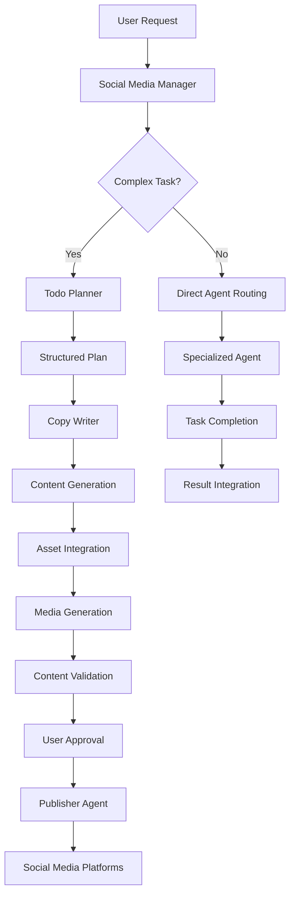

# Multimodal Agent System

A comprehensive AI-powered social media management platform that combines intelligent agents, advanced scraping capabilities, and seamless content creation workflows. The system features a sophisticated multi-agent architecture with persistent memory, real-time WebSocket communication, and an intuitive drag-and-drop interface.

## 🚀 Project Overview

The Multimodal Agent System is designed to revolutionize social media content creation and management through AI-driven automation. It combines multiple specialized agents working in harmony to handle complex workflows including research, content planning, asset management, media generation, and social media publishing.

### Key Features

- **Multi-Agent Architecture**: Specialized AI agents for different tasks (social media management, research, asset management, content planning)
- **Real-time Communication**: WebSocket-based communication with persistent session management
- **Advanced Scraping**: Unified scraping across Instagram, LinkedIn, YouTube, and Reddit
- **Drag-and-Drop Interface**: Intuitive asset management with context-aware content creation
- **Memory System**: Persistent memory across sessions with chat-scoped storage
- **Content Generation**: AI-powered content creation with platform-specific optimization
- **Publisher Integration**: Direct publishing to multiple social media platforms

## 🏗️ High-Level System Design

### Architecture Overview

The system follows a microservices architecture with clear separation of concerns:

```
┌─────────────────────────────────────────────────────────────────┐
│                        Frontend Layer                          │
│  ┌─────────────┐  ┌─────────────┐  ┌─────────────────────────┐ │
│  │   Next.js   │  │  Asset      │  │    Drag & Drop         │ │
│  │   React     │  │  Manager    │  │    Interface           │ │
│  │   UI        │  │  Page       │  │                        │ │
│  └─────────────┘  └─────────────┘  └─────────────────────────┘ │
└─────────────────────────────────────────────────────────────────┘
                                │
                                │ WebSocket/HTTP
                                ▼
┌─────────────────────────────────────────────────────────────────┐
│                      Backend Layer                              │
│  ┌─────────────┐  ┌─────────────┐  ┌─────────────────────────┐ │
│  │   FastAPI   │  │   Agent     │  │      Tool System        │ │
│  │   Server    │  │  Registry   │  │                        │ │
│  └─────────────┘  └─────────────┘  └─────────────────────────┘ │
│  ┌─────────────┐  ┌─────────────┐  ┌─────────────────────────┐ │
│  │   Session   │  │   Memory    │  │      Verification       │ │
│  │  Management │  │   System    │  │       System            │ │
│  └─────────────┘  └─────────────┘  └─────────────────────────┘ │
└─────────────────────────────────────────────────────────────────┘
                                │
                                │ MongoDB
                                ▼
┌─────────────────────────────────────────────────────────────────┐
│                      Data Layer                                 │
│  ┌─────────────┐  ┌─────────────┐  ┌─────────────────────────┐ │
│  │   MongoDB   │  │   Cloudinary │  │    External APIs        │ │
│  │  Database   │  │   Storage    │  │   (Social Media)       │ │
│  └─────────────┘  └─────────────┘  └─────────────────────────┘ │
└─────────────────────────────────────────────────────────────────┘
```

### Core Components

1. **Frontend (Next.js)**: Modern React-based UI with real-time updates
2. **Backend (FastAPI)**: High-performance async Python API server
3. **Agent System**: Multi-agent orchestration with specialized capabilities
4. **Memory System**: Persistent, chat-scoped memory management
5. **Tool System**: Extensible tool framework for external integrations
6. **Database Layer**: MongoDB for data persistence and session management

## 🤖 Main Agent Architecture

### Social Media Manager (Primary Agent)

The **Social Media Manager** serves as the central orchestration agent, coordinating all other agents and managing complex workflows.

#### Core Capabilities:
- **Content Strategy**: Advises on cadence, KPIs, and content repurposing
- **Agent Orchestration**: Routes work to specialized agents based on task requirements
- **Workflow Management**: Handles PLAN, EXECUTE, and PUBLISH modes
- **Quality Assurance**: Validates outputs and ensures compliance
- **Multi-step Coordination**: Manages complex multi-agent workflows

#### Operational Modes:
1. **PLAN Mode**: Coordinates with `todo_planner` for structured planning
2. **EXECUTE Mode**: Orchestrates subagents to produce assets
3. **PUBLISH Mode**: Handles publishing with explicit user authorization

#### Key Features:
- **Intent Extraction**: Interprets user briefs and extracts constraints
- **Agent Routing**: Intelligent routing to specialized agents
- **Validation**: Platform-specific requirement validation
- **Audit Trail**: Comprehensive logging of agent interactions

### Sub-Agent Architecture

#### 1. Todo Planner Agent
**Purpose**: Creates and manages structured todo lists for complex workflows

**Capabilities**:
- Structured todo list creation
- Content planning and organization
- Task breakdown and prioritization
- Progress tracking and updates
- Multi-step workflow management

**Key Features**:
- Chat-scoped memory integration
- User metadata context awareness
- Image path handling for visual content
- Structured JSON output for task management

#### 2. Asset Agent
**Purpose**: Manages and retrieves user data including brands, competitors, and templates

**Capabilities**:
- Brand management and retrieval
- Competitor data access
- Template management
- Scraped posts filtering
- Multi-task operations
- Analytics and statistics

**Key Features**:
- Flexible querying with search functionality
- CRUD operations for all data types
- Natural language assistance
- User-scoped data access

#### 3. Research Agent
**Purpose**: Performs grounded searches and synthesizes findings

**Capabilities**:
- Web-grounded search via Perplexity Sonar Pro
- Google-grounded searches via Gemini wrapper
- Information synthesis and citation
- Multi-source research coordination

**Key Features**:
- Structured search results
- Source attribution
- Concise answer generation
- Research planning and execution

#### 4. Copy Writer Agent
**Purpose**: Generates platform-native content including scripts, captions, and CTAs

**Capabilities**:
- Platform-specific content generation
- Structured JSON output with multiple creative options
- Reference analysis and integration
- Content type specialization (reels, carousels, articles)

**Key Features**:
- Content-type-specific schemas
- Multiple creative variations
- Brand voice consistency
- Platform optimization

#### 5. Media Analyst Agent
**Purpose**: Analyzes media content and provides insights

**Capabilities**:
- Media content analysis
- Performance insights
- Trend identification
- Content optimization recommendations

#### 6. Social Media Search Agent
**Purpose**: Specialized search across social media platforms

**Capabilities**:
- Cross-platform search
- Content discovery
- Trend analysis
- Competitor monitoring

#### 7. Media Activist Agent
**Purpose**: Handles media generation and manipulation

**Capabilities**:
- Image generation and editing
- Video creation and composition
- Audio processing
- Media optimization

## 📱 Publisher Agent Architecture

### Social Media Publishing System

The publisher system enables direct content publishing to multiple social media platforms with comprehensive error handling and verification.

#### Supported Platforms:
1. **Instagram**: Posts, stories, reels
2. **Facebook**: Posts, photos, videos
3. **LinkedIn**: Company posts, articles
4. **YouTube**: Videos, shorts, community posts

#### Key Features:
- **OAuth Integration**: Secure authentication with platform APIs
- **Content Validation**: Pre-publish content validation
- **Error Handling**: Comprehensive error diagnosis and recovery
- **Batch Publishing**: Multi-platform simultaneous publishing
- **Scheduling**: Advanced scheduling capabilities

#### Publisher Components:

```python
# Publisher Agent Structure
class PublisherAgent:
    def __init__(self):
        self.platforms = {
            'instagram': InstagramPublisher(),
            'facebook': FacebookPublisher(),
            'linkedin': LinkedInPublisher(),
            'youtube': YouTubePublisher()
        }
    
    async def publish_content(self, content, platforms, schedule_time=None):
        # Multi-platform publishing logic
        pass
    
    async def validate_content(self, content, platform):
        # Platform-specific validation
        pass
```

## 🔍 Scraping and Search Architecture

### Unified Scraping System

The system provides comprehensive scraping capabilities across multiple social media platforms with intelligent data processing and storage.

#### Supported Platforms:
- **Instagram**: Posts, stories, profiles, hashtags
- **LinkedIn**: Company posts, personal posts, articles
- **YouTube**: Videos, channels, playlists, comments
- **Reddit**: Posts, comments, subreddits

#### Scraping Features:

1. **Unified Interface**: Single API for all platforms
2. **Intelligent Data Processing**: Normalization and enrichment
3. **Database Integration**: Automatic storage and indexing
4. **Rate Limiting**: Respectful scraping with delays
5. **Error Recovery**: Robust error handling and retry logic

#### Scraping Workflow:

```python
# Scraping Process Flow
async def scrape_social_media(platform, identifier, options):
    # 1. Platform-specific scraper selection
    scraper = get_scraper(platform)
    
    # 2. Data extraction
    raw_data = await scraper.scrape(identifier, options)
    
    # 3. Data normalization
    normalized_data = normalize_data(raw_data, platform)
    
    # 4. Database storage
    if options.save_to_db:
        await store_scraped_data(normalized_data)
    
    # 5. Return processed data
    return normalized_data
```

#### Search Capabilities:

- **Cross-platform Search**: Unified search across all platforms
- **Advanced Filtering**: Date ranges, engagement metrics, content types
- **Text Search**: Full-text search within scraped content
- **Trend Analysis**: Identify trending topics and content
- **Competitor Monitoring**: Track competitor activity

## 🔄 Project Workflow

### Content Creation Workflow

The system follows a structured workflow for content creation and publishing:



### Workflow Stages:

1. **Request Analysis**: Social Media Manager analyzes user intent
2. **Planning**: Todo Planner creates structured task lists
3. **Content Creation**: Copy Writer generates platform-specific content
4. **Asset Integration**: Asset Agent provides relevant assets
5. **Media Generation**: Media Activist creates visual/audio content
6. **Validation**: System validates content against platform requirements
7. **Approval**: User reviews and approves content
8. **Publishing**: Publisher Agent distributes content to platforms

### Task Management Workflow:

```python
# Todo Management Process
async def manage_todo_workflow(chat_id, task_description):
    # 1. Create initial todo list
    todo_list = await todo_planner.create_plan(task_description)
    
    # 2. Execute tasks sequentially
    for task in todo_list.tasks:
        # 3. Route to appropriate agent
        result = await route_to_agent(task)
        
        # 4. Update task status
        await update_task_status(task.id, "completed")
        
        # 5. Check for dependencies
        if task.has_dependencies:
            await check_dependencies(task)
    
    # 6. Final validation
    await validate_completed_workflow(todo_list)
```

## 📊 Data Flow Architecture

### Data Flow Overview

The system manages data flow across multiple layers with clear separation of concerns:

```
┌─────────────────────────────────────────────────────────────────┐
│                    Data Flow Architecture                       │
└─────────────────────────────────────────────────────────────────┘

User Input → WebSocket → Session Context → Agent Router → Tool System
     ↓           ↓            ↓              ↓            ↓
Memory Store ← MongoDB ← Agent Memory ← Tool Results ← External APIs
     ↓           ↓            ↓              ↓            ↓
Frontend ← WebSocket ← Session Context ← Agent Output ← Tool Router
```

### Data Flow Components:

#### 1. Input Processing
- **WebSocket Reception**: Real-time message handling
- **Authentication**: User verification and session creation
- **Message Parsing**: JSON parsing and validation
- **Context Building**: Session and memory context creation

#### 2. Agent Processing
- **Routing**: Intelligent agent selection
- **Memory Integration**: Chat-scoped memory retrieval
- **Tool Invocation**: External tool execution
- **Result Processing**: Output formatting and validation

#### 3. Data Persistence
- **Chat Storage**: Message history persistence
- **Memory Storage**: Agent memory persistence
- **Asset Storage**: Media and content storage
- **Session Management**: User session tracking

#### 4. Output Delivery
- **WebSocket Response**: Real-time result delivery
- **Frontend Updates**: UI state synchronization
- **Error Handling**: Graceful error management
- **Logging**: Comprehensive audit trail

### Data Storage Strategy:

#### MongoDB Collections:
- **chats**: Chat metadata and configuration
- **chat_messages**: Message history with metadata
- **agent_memories**: Per-agent memory storage
- **brands**: Brand information and settings
- **competitors**: Competitor data and analysis
- **templates**: Content templates and configurations
- **scraped_posts**: Scraped social media content

#### Cloudinary Integration:
- **Media Storage**: Images, videos, and audio files
- **CDN Delivery**: Fast global content delivery
- **Transformations**: On-the-fly media optimization
- **Metadata**: Rich media metadata storage

## 🛠️ Tool System Architecture

### Tool Framework Overview

The tool system provides a flexible, extensible framework for integrating external services and APIs.

#### Tool Categories:

1. **Research Tools**: Web search, information gathering
2. **Media Tools**: Image/video generation, processing
3. **Social Media Tools**: Platform-specific operations
4. **Data Tools**: Database operations, analytics
5. **Verification Tools**: Error diagnosis, validation

#### Tool Router Architecture:

```python
# Tool Router System
class ToolRouter:
    def __init__(self):
        self.tools = {}
        self.api_keys = {}
    
    async def route_tool_call(self, tool_name, input_schema):
        # 1. Tool validation
        if not self.is_valid_tool(tool_name):
            raise ToolNotFoundError(tool_name)
        
        # 2. API key management
        api_key = self.get_api_key(tool_name)
        
        # 3. Tool execution
        result = await self.execute_tool(tool_name, input_schema, api_key)
        
        # 4. Result validation
        return self.validate_result(result)
```

#### Key Tools:

##### Research Tools:
- **Perplexity Sonar Pro**: Advanced web search
- **Gemini Google Search**: Google-powered search
- **Unified Search**: Cross-platform social media search

##### Media Tools:
- **Gemini Image**: AI image generation
- **Gemini Video**: AI video creation
- **Azure Speech**: Text-to-speech conversion
- **Minimax Audio**: Voice cloning and synthesis

##### Social Media Tools:
- **Instagram Scraper**: Content extraction
- **LinkedIn Scraper**: Professional content scraping
- **YouTube Scraper**: Video and channel data
- **Reddit Scraper**: Community content scraping

##### Data Tools:
- **Brand Management**: CRUD operations for brands
- **Competitor Analysis**: Competitor data management
- **Template Management**: Content template operations
- **Analytics**: Performance and engagement metrics

##### Verification Tools:
- **Error Diagnosis**: Comprehensive error analysis
- **Content Validation**: Platform-specific validation
- **Quality Assurance**: Content quality assessment

### Tool Integration Pattern:

```python
# Tool Integration Example
async def tool_integration_example():
    # 1. Tool registration
    tool_router.register_tool("search_instagram", InstagramSearchTool())
    
    # 2. Tool invocation
    result = await tool_router.call_tool(
        "search_instagram",
        {
            "query": "marketing trends",
            "limit": 10,
            "platform": "instagram"
        }
    )
    
    # 3. Result processing
    processed_result = await process_tool_result(result)
    
    # 4. Memory integration
    await session_context.add_memory("search_results", processed_result)
```

## 🧠 Memory System Design

### Memory Architecture Overview

The memory system provides persistent, chat-scoped memory management with intelligent context retrieval and storage.

#### Memory Components:

1. **AgentMemory**: Per-agent memory with size limits
2. **SessionContext**: Session state and memory coordination
3. **SessionManager**: Multi-session management
4. **MongoStore**: Persistent storage backend

#### Memory Structure:

```python
# Memory System Architecture
class MemorySystem:
    def __init__(self):
        self.agent_memories = {}  # Per-agent memory stores
        self.session_contexts = {}  # Active session contexts
        self.mongo_store = MongoStore()  # Persistent storage
    
    async def add_memory(self, agent_name, content, metadata=None):
        # 1. Add to in-memory store
        await self.agent_memories[agent_name].add(content, metadata)
        
        # 2. Persist to database
        await self.mongo_store.save_agent_memory(
            agent_name, content, metadata
        )
    
    async def get_context(self, agent_name, max_tokens=4000):
        # 1. Retrieve from in-memory store
        recent_memories = await self.agent_memories[agent_name].get_recent()
        
        # 2. Format for prompt context
        context_string = self.format_context(recent_memories, max_tokens)
        
        return context_string
```

#### Memory Features:

##### 1. Chat-Scoped Storage
- **Isolation**: Each chat maintains separate memory
- **Persistence**: Memory survives session restarts
- **Cleanup**: Automatic cleanup of old memories

##### 2. Agent-Specific Memory
- **Specialization**: Each agent maintains its own memory
- **Context Awareness**: Memory includes relevant metadata
- **Size Management**: Automatic size limits and cleanup

##### 3. Memory Retrieval
- **Context Building**: Intelligent context string generation
- **Token Management**: Token-aware memory selection
- **Relevance Filtering**: Filter memories by relevance

##### 4. Memory Persistence
- **Database Storage**: MongoDB-based persistent storage
- **Serialization**: JSON-based memory serialization
- **Recovery**: Memory recovery from database

#### Memory Workflow:

```python
# Memory Management Workflow
async def memory_workflow_example():
    # 1. Session creation
    session_context = await create_session(user_id, agent_names)
    
    # 2. Memory hydration
    await session_context.hydrate_memories_from_db(chat_id)
    
    # 3. Memory addition
    await session_context.append_and_persist_memory(
        "social_media_manager",
        "User requested content creation for Instagram",
        {"timestamp": datetime.now(), "query_type": "content_creation"}
    )
    
    # 4. Memory retrieval
    memory_context = await session_context.get_agent_memory("social_media_manager")
    context_string = await memory_context.get_context_string(max_tokens=2000)
    
    # 5. Memory persistence
    await session_context.persist_memories_to_db()
```

#### Memory Optimization:

- **Token Management**: Efficient token usage
- **Relevance Scoring**: Memory relevance assessment
- **Compression**: Memory compression techniques
- **Cleanup**: Automatic memory cleanup

## 🎨 Frontend Implementation and Design

### Frontend Architecture

The frontend is built with Next.js 14 and React 18, providing a modern, responsive user interface with real-time capabilities.

#### Technology Stack:
- **Framework**: Next.js 14 with App Router
- **UI Library**: React 18 with Hooks
- **Styling**: Tailwind CSS with custom components
- **Icons**: Lucide React and Heroicons
- **State Management**: React hooks and context
- **Real-time**: WebSocket integration

#### Key Components:

##### 1. Chat Interface (`ChatInterface.js`)
- **Real-time Communication**: WebSocket-based chat
- **Message Handling**: Text, image, and file messages
- **Agent Integration**: Multi-agent conversation support
- **Memory Integration**: Chat history and context

##### 2. Asset Manager (`AssetManagerPage`)
- **Brand Management**: Brand selection and configuration
- **Data Visualization**: Charts and analytics
- **CRUD Operations**: Create, read, update, delete operations
- **Search and Filtering**: Advanced search capabilities

##### 3. Drag and Drop System (`AssetDragDrop.js`)
- **Asset Selection**: Brands, competitors, templates, posts
- **Drag Operations**: Intuitive drag-and-drop interface
- **Context Integration**: Asset context for content creation
- **Platform Filtering**: Platform-specific asset filtering

#### Drag and Drop Feature Details:

##### Implementation:
```javascript
// Drag and Drop Implementation
const AssetDragDrop = ({ isOpen, onClose, onAssetDrop, embedded = false }) => {
  const [activeTab, setActiveTab] = useState('brands');
  const [assets, setAssets] = useState({
    brands: [],
    competitors: [],
    templates: [],
    scrapedPosts: []
  });

  const handleDragStart = (e, asset, type) => {
    e.dataTransfer.setData('application/json', JSON.stringify({
      type,
      asset
    }));
    e.dataTransfer.effectAllowed = 'copy';
  };

  const handleDrop = (e) => {
    e.preventDefault();
    const data = JSON.parse(e.dataTransfer.getData('application/json'));
    onAssetDrop(data);
  };
```

##### Features:
- **Multi-tab Interface**: Brands, competitors, templates, posts
- **Platform Filtering**: Instagram, LinkedIn, YouTube, Reddit
- **Asset Preview**: Rich asset previews with metadata
- **Context Integration**: Asset context for content creation
- **Search Functionality**: Real-time asset search

##### User Experience:
- **Intuitive Interface**: Easy-to-use drag-and-drop
- **Visual Feedback**: Clear drag states and feedback
- **Asset Organization**: Logical asset categorization
- **Quick Access**: Fast asset selection and integration

#### Frontend Design Principles:

##### 1. Responsive Design
- **Mobile-First**: Mobile-optimized interface
- **Adaptive Layout**: Responsive grid system
- **Touch-Friendly**: Touch-optimized interactions
- **Cross-Platform**: Consistent experience across devices

##### 2. User Experience
- **Intuitive Navigation**: Clear navigation structure
- **Visual Hierarchy**: Clear information hierarchy
- **Loading States**: Smooth loading animations
- **Error Handling**: Graceful error management

##### 3. Performance
- **Code Splitting**: Dynamic imports and lazy loading
- **Image Optimization**: Next.js image optimization
- **Caching**: Intelligent caching strategies
- **Bundle Optimization**: Minimal bundle sizes

##### 4. Accessibility
- **Keyboard Navigation**: Full keyboard support
- **Screen Reader**: ARIA labels and descriptions
- **Color Contrast**: WCAG-compliant color schemes
- **Focus Management**: Clear focus indicators

#### Component Architecture:

```javascript
// Component Structure
src/
├── app/
│   ├── page.js                 # Main chat interface
│   ├── asset-manager/
│   │   └── page.js            # Asset manager page
│   ├── layout.js               # Root layout
│   └── globals.css             # Global styles
├── components/
│   ├── ChatInterface.js        # Main chat component
│   ├── AssetDragDrop.js       # Drag and drop interface
│   ├── ChatInput.js           # Message input component
│   ├── ChatHistory.js         # Message history display
│   ├── Message.js             # Individual message component
│   ├── TodoList.js            # Todo list component
│   ├── TodoDisplay.js         # Todo display component
│   ├── GoogleSignIn.js         # Authentication component
│   ├── UserProfile.js         # User profile component
│   └── asset-manager/         # Asset manager components
│       ├── AssetManagerSidebar.js
│       ├── AssetManagerContent.js
│       └── AssetManagerChatbot.js
└── lib/
    └── api/
        └── socialMedia.js     # API client
```

## 📁 Project Directory Structure

### Backend Structure

```
backend/
├── agents/                          # AI Agent implementations
│   ├── social_media_manager.py     # Main orchestration agent
│   ├── todo_planner.py             # Task planning agent
│   ├── asset_agent.py              # Asset management agent
│   ├── research_agent.py           # Research and search agent
│   ├── copy_writer.py              # Content creation agent
│   ├── media_analyst.py            # Media analysis agent
│   ├── media_activist.py            # Media generation agent
│   └── social_media_search_agent.py # Social media search agent
├── tools/                           # Tool implementations
│   ├── verification_tool.py        # Error diagnosis and validation
│   ├── todo_manager.py             # Todo list management
│   ├── asset_crud_operations.py    # Asset CRUD operations
│   ├── content_planner.py          # Content planning tools
│   ├── user_data_tools.py          # User data management
│   ├── get_media.py                # Media generation tools
│   ├── unified_search.py            # Unified search tools
│   ├── unified_scraper.py           # Unified scraping tools
│   ├── research.py                 # Research tools
│   ├── gemini_image.py             # Gemini image generation
│   ├── gemini_video.py             # Gemini video generation
│   ├── youtube_publisher.py         # YouTube publishing
│   ├── linkedinscrape.py            # LinkedIn scraping
│   ├── google_sheets.py             # Google Sheets integration
│   ├── service_account.json        # Google service account
│   ├── media_generation/            # Media generation tools
│   └── publishers/                  # Publishing tools
├── utils/                           # Utility modules
│   ├── agent_registry.py           # Agent registration system
│   ├── router.py                   # Agent routing
│   ├── tool_router.py              # Tool routing system
│   ├── session_memory.py            # Memory management
│   ├── build_prompts.py            # Prompt building
│   ├── mongo_store.py              # MongoDB operations
│   ├── upload_cloudinary.py         # Cloudinary integration
│   ├── utility.py                   # General utilities
│   ├── title_generator.py           # Chat title generation
│   ├── dowloader.py                # File download utilities
│   ├── searchers/                   # Search utilities
│   ├── scrapers/                    # Scraping utilities
│   └── my_downloads/                # Download storage
├── routes/                           # API routes
│   ├── auth.py                      # Authentication routes
│   ├── chats.py                     # Chat management routes
│   ├── brands.py                    # Brand management routes
│   ├── templates.py                  # Template management routes
│   ├── competitors.py               # Competitor management routes
│   ├── scraped_posts.py            # Scraped posts routes
│   ├── scraping.py                  # Scraping routes
│   └── todos.py                     # Todo management routes
├── services/                         # Business logic services
│   ├── auth.py                      # Authentication service
│   └── social_media_db.py           # Social media database service
├── models/                           # Data models
│   ├── chat_openai.py               # OpenAI chat model
│   └── social_media.py               # Social media data models
├── database.py                       # Database connection
├── main.py                           # FastAPI application entry point
├── system_prompts.json              # Agent system prompts
├── requirements.txt                  # Python dependencies
├── SOCIAL_MEDIA_API_SETUP_GUIDE.md  # API setup guide
└── uploads/                          # File upload storage
```

### Frontend Structure

```
frontend/
├── src/
│   ├── app/
│   │   ├── page.js                  # Main chat interface
│   │   ├── asset-manager/
│   │   │   └── page.js             # Asset manager page
│   │   ├── layout.js               # Root layout component
│   │   ├── globals.css             # Global styles
│   │   └── favicon.ico             # Favicon
│   └── components/
│       ├── ChatInterface.js        # Main chat component
│       ├── AssetDragDrop.js        # Drag and drop interface
│       ├── ChatInput.js            # Message input component
│       ├── ChatHistory.js          # Message history display
│       ├── Message.js               # Individual message component
│       ├── TodoList.js              # Todo list component
│       ├── TodoDisplay.js           # Todo display component
│       ├── GoogleSignIn.js          # Authentication component
│       ├── UserProfile.js           # User profile component
│       └── asset-manager/           # Asset manager components
│           ├── AssetManagerSidebar.js
│           ├── AssetManagerContent.js
│           └── AssetManagerChatbot.js
├── lib/
│   └── api/
│       └── socialMedia.js           # API client
├── public/                          # Static assets
├── package.json                     # Node.js dependencies
├── package-lock.json                # Dependency lock file
├── next.config.js                   # Next.js configuration
├── next.config.mjs                  # Next.js module configuration
├── tailwind.config.js               # Tailwind CSS configuration
├── postcss.config.js                # PostCSS configuration
├── eslint.config.mjs                # ESLint configuration
├── jsconfig.json                    # JavaScript configuration
└── install-deps.sh                  # Dependency installation script
```

### Root Structure

```
Multimodal Agent/
├── backend/                          # Backend application
├── frontend/                         # Frontend application
├── utility/                          # Utility scripts and tools
├── index.html                        # System architecture documentation
├── ASSET_MANAGER_CHATBOT_README.md   # Asset manager documentation
├── README.md                         # This file
└── .gitignore                        # Git ignore rules
```

## 🚀 Getting Started

### Prerequisites

- **Python 3.8+**: Backend runtime
- **Node.js 18+**: Frontend runtime
- **MongoDB**: Database server
- **Cloudinary Account**: Media storage
- **Social Media API Keys**: Platform integrations

### Installation

#### Backend Setup

1. **Clone the repository**
   ```bash
   git clone <repository-url>
   cd "Multimodal Agent"
   ```

2. **Install Python dependencies**
   ```bash
   cd backend
   pip install -r requirements.txt
   ```

3. **Configure environment variables**
   ```bash
   cp .env.example .env
   # Edit .env with your configuration
   ```

4. **Start the backend server**
   ```bash
   python main.py
   ```

#### Frontend Setup

1. **Install Node.js dependencies**
   ```bash
   cd frontend
   npm install
   ```

2. **Start the development server**
   ```bash
   npm run dev
   ```

### Configuration

#### Environment Variables

```bash
# Database
MONGODB_URL=mongodb://localhost:27017/multimodal_agent

# Cloudinary
CLOUDINARY_CLOUD_NAME=your_cloud_name
CLOUDINARY_API_KEY=your_api_key
CLOUDINARY_API_SECRET=your_api_secret

# Social Media APIs
INSTAGRAM_ACCESS_TOKEN=your_instagram_token
FACEBOOK_PAGE_ID=your_facebook_page_id
LINKEDIN_CLIENT_ID=your_linkedin_client_id
YOUTUBE_API_KEY=your_youtube_api_key

# AI Services
OPENAI_API_KEY=your_openai_key
GEMINI_API_KEY=your_gemini_key
PERPLEXITY_API_KEY=your_perplexity_key
```

#### API Setup

Follow the detailed setup guide in `backend/SOCIAL_MEDIA_API_SETUP_GUIDE.md` for configuring social media platform APIs.

### Usage

#### Basic Usage

1. **Start the application**
   - Backend: `python backend/main.py`
   - Frontend: `npm run dev --prefix frontend`

2. **Access the application**
   - Open `http://localhost:3000`
   - Sign in with Google
   - Start chatting with the AI agents

#### Advanced Features

1. **Asset Management**
   - Navigate to `/asset-manager`
   - Manage brands, competitors, and templates
   - Use drag-and-drop for content creation

2. **Content Creation**
   - Request content creation tasks
   - Use todo planner for complex workflows
   - Generate platform-specific content

3. **Social Media Publishing**
   - Configure platform APIs
   - Create and schedule content
   - Monitor performance metrics

## 🔧 Development

### Adding New Agents

1. **Create agent file**
   ```python
   # backend/agents/new_agent.py
   async def new_agent(query: str, model_name: str = "gpt-4o-mini", **kwargs):
       # Agent implementation
       pass
   ```

2. **Register in system prompts**
   ```json
   {
     "agents": {
       "new_agent": {
         "short_description": "Agent description",
         "capabilities": ["capability1", "capability2"],
         "default_prompt_template": "System prompt..."
       }
     }
   }
   ```

3. **Update agent registry**
   ```python
   # backend/utils/agent_registry.py
   AGENT_REGISTRY["new_agent"] = new_agent
   ```

### Adding New Tools

1. **Create tool file**
   ```python
   # backend/tools/new_tool.py
   async def new_tool(param1: str, param2: int) -> dict:
       # Tool implementation
       return {"result": "success"}
   ```

2. **Register in tool router**
   ```python
   # backend/utils/tool_router.py
   API_KEY_MAPPINGS["new_tool"] = "NEW_TOOL_API_KEY"
   ```

3. **Update agent prompts**
   ```json
   {
     "tools": ["new_tool"]
   }
   ```

### Testing

#### Backend Testing

```bash
cd backend
python -m pytest tests/
```

#### Frontend Testing

```bash
cd frontend
npm test
```

## 📚 API Documentation

### WebSocket API

#### Connection
```javascript
const ws = new WebSocket('ws://localhost:8000/ws');
```

#### Authentication
```javascript
ws.send(JSON.stringify({
  token: 'your_jwt_token'
}));
```

#### Message Format
```javascript
ws.send(JSON.stringify({
  text: 'User message',
  chat_id: 'chat_uuid',
  signature: 'agent_name' // Optional
}));
```

### HTTP API

#### Chat Management
- `GET /api/chats` - List user chats
- `POST /api/chats` - Create new chat
- `PUT /api/chats/{chat_id}` - Update chat
- `DELETE /api/chats/{chat_id}` - Delete chat

#### Brand Management
- `GET /api/brands` - List user brands
- `POST /api/brands` - Create new brand
- `PUT /api/brands/{brand_id}` - Update brand
- `DELETE /api/brands/{brand_id}` - Delete brand

#### Scraping
- `POST /api/scraping/scrape` - Scrape social media
- `GET /api/scraping/status` - Get scraping status

## 🤝 Contributing

### Development Guidelines

1. **Code Style**: Follow PEP 8 for Python, ESLint for JavaScript
2. **Testing**: Write tests for new features
3. **Documentation**: Update documentation for changes
4. **Commits**: Use conventional commit messages

### Pull Request Process

1. Fork the repository
2. Create a feature branch
3. Make your changes
4. Add tests
5. Submit a pull request

## 📄 License

This project is licensed under the MIT License - see the LICENSE file for details.

## 🆘 Support

### Troubleshooting

#### Common Issues

1. **WebSocket Connection Failed**
   - Check backend server is running
   - Verify CORS configuration
   - Check firewall settings

2. **Authentication Errors**
   - Verify Google OAuth configuration
   - Check JWT token validity
   - Ensure user permissions

3. **Database Connection Issues**
   - Check MongoDB server status
   - Verify connection string
   - Check network connectivity

#### Getting Help

- **Documentation**: Check this README and code comments
- **Issues**: Create GitHub issues for bugs
- **Discussions**: Use GitHub discussions for questions

### Contact

For support and questions:
- **Email**: support@example.com
- **GitHub**: Create an issue
- **Documentation**: Check the documentation

---

## 🎯 Roadmap

### Upcoming Features

- **Advanced Analytics**: Comprehensive performance analytics
- **AI-Powered Insights**: Intelligent content recommendations
- **Team Collaboration**: Multi-user collaboration features
- **Mobile App**: Native mobile applications
- **API Marketplace**: Third-party tool integrations

### Long-term Vision

- **Enterprise Features**: Advanced enterprise capabilities
- **White-label Solution**: Customizable white-label platform
- **Global Expansion**: Multi-language and multi-region support
- **AI Evolution**: Advanced AI capabilities and automation

---

*This README provides a comprehensive overview of the Multimodal Agent System. For detailed implementation information, refer to the source code and inline documentation.*